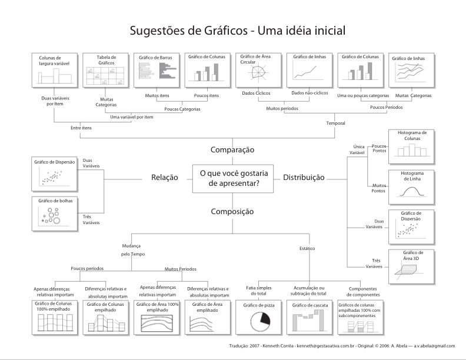
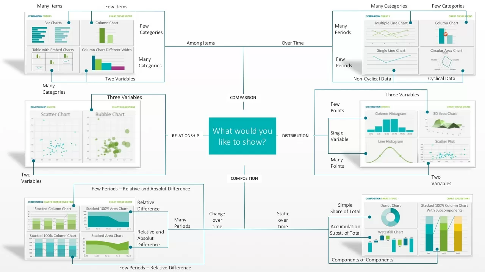

# 📝 Módulo 3 — Caderno de Anotações  
### Visualização de Dados

---

# 📌 Item 1 — Fundamentos de Visualização

## 🎯 Ideia principal
A visualização é uma ferramenta essencial para entender dados.  
O tipo de gráfico adequado depende do tipo de variável analisada (categórica ou contínua) e do objetivo da análise (comparar, mostrar distribuição, composição ou relação entre variáveis).

<p float="left">
  
  
</p>


---

## 🧠 Conceitos importantes

### **1. Escolha do gráfico depende do tipo de variável**
- **Variáveis categóricas** → gráficos de barras, colunas, pizza.  
- **Variáveis contínuas** → histogramas, gráficos de dispersão, boxplots.  

### **2. Método de Apresentação Extrema (Dr. Andrew Abela)**
Guia para escolher o gráfico certo conforme o objetivo:

```text
| Objetivo                                  | Tipo de gráfico            
|-------------------------------------------|-------------------------
| Comparar categorias                       | barras, colunas            
| Comparar ao longo do tempo                | linhas                     
| Mostrar relação entre variáveis contínuas | dispersão                  
| Mostrar composição                        | pizza, barras empilhadas   
| Mostrar distribuição                      | histogramas, densidade     
```

### **3. Gráficos com múltiplas variáveis**
- Gráfico de bolhas → 3 variáveis (x, y, tamanho).  
- FacetGrid → várias dimensões categóricas.

### **4. Ferramentas usadas no curso**
- **Seaborn**  
- **Matplotlib**

---

## 📚 Termos explicados
- **Dispersão**: relação entre duas variáveis contínuas.  
- **Composição**: como um todo é dividido em partes.  
- **Distribuição**: como os valores se espalham.  
- **FacetGrid**: grade de gráficos segmentados por categorias.

## ✍️ Minhas anotações
-  
-  
-  

---

# 📌 Item 2 — Estatísticas por Grupos

## 🎯 Ideia principal
Usamos médias e desvios padrão para comparar grupos (ex.: homens vs mulheres, titulares vs não titulares).  
Mas é essencial garantir que os dados não contenham **duplicatas que distorcem a média**.

---

## 🧠 Conceitos importantes

### **1. Comparação entre grupos**
Exemplos do vídeo:
- Avaliação média de ensino por gênero.  
- Avaliação média por status (titular vs não titular).  
- Idade média por grupo.

### **2. Problema das duplicatas**
O dataset tem:
- **463 cursos**, mas  
- **94 instrutores únicos**.

Se um instrutor ministra vários cursos, ele aparece várias vezes → isso **distorce médias**.

### **3. Solução**
Criar um dataset com **uma linha por instrutor** antes de calcular médias.

### **4. Visualização para comparação**
- Gráficos de barras (countplot).  
- Adicionar título → melhora comunicação.  
- Adicionar `hue` → adiciona uma segunda dimensão (ex.: gênero + titularidade).  
- FacetGrid → múltiplas dimensões (ex.: gênero + titularidade + divisão do curso).

---

## 📚 Termos explicados
- **Duplicatas**: mesma pessoa aparecendo várias vezes.  
- **Countplot**: gráfico de barras para contagens.  
- **Hue**: separa categorias por cor.  
- **FacetGrid**: cria vários gráficos segmentados.

## ✍️ Minhas anotações
-  
-  
-  

---

# 📌 Item 3 — Gráficos Estatísticos

## 🎯 Ideia principal
Além de médias e contagens, precisamos visualizar **distribuições** e **variabilidade** usando histogramas e boxplots.

---

## 🧠 Conceitos importantes

### **1. Histogramas**
- Mostram a distribuição de uma variável contínua.  
- Úteis para identificar:
  - assimetria  
  - concentração  
  - outliers  
  - forma da distribuição  

### **2. Boxplots**
Mostram:
- mediana  
- 1º quartil  
- 3º quartil  
- mínimo  
- máximo  
- intervalo interquartil (IQR)

Permitem comparar grupos facilmente.

### **3. Histogramas por subgrupos**
Ex.: homens vs mulheres → diferenças na distribuição podem explicar diferenças nas médias.

### **4. Boxplots com múltiplas dimensões**
- Eixo X → variável contínua (ex.: idade)  
- Eixo Y → categoria (ex.: gênero)  
- `hue` → outra categoria (ex.: titularidade)

### **5. Gráficos de pizza**
- Mostram composição simples.  
- Ex.: proporção de cursos ministrados por homens vs mulheres.

---

## 📚 Termos explicados
- **Quartis**: pontos que dividem os dados em 4 partes.  
- **IQR (Intervalo Interquartil)**: Q3 – Q1.  
- **Distribuição normal**: curva em formato de sino.  
- **Densidade**: suavização da distribuição.

## ✍️ Minhas anotações
-  
-  
-  

---

# 📌 Item 4 — Apresentando os Dados de Avaliação do Professor

## 🎯 Ideia principal
O vídeo apresenta o dataset real usado no curso e discute como visualizar suas variáveis principais.

---

## 🧠 Conceitos importantes

### **1. Variáveis principais**
- **Beleza** (score padronizado → média 0, desvio padrão 1)  
- **Avaliação de ensino** (1 a 5)  
- **Idade**  
- **Gênero**  
- **Minoria**  
- **Falante nativo**  
- **Titularidade**  

### **2. Estatísticas descritivas**
Para variáveis contínuas:
- média  
- mínimo  
- máximo  
- desvio padrão  

Para variáveis categóricas:
- contagens  
- porcentagens  

### **3. Comparação entre dados reais e distribuição normal**
- Dados reais raramente seguem perfeitamente a curva normal.  
- A distribuição teórica é mais suave.

### **4. Pergunta central do módulo**
> A beleza influencia a avaliação de ensino?

O módulo prepara terreno para análises futuras.

---

## 📚 Termos explicados
- **Padronização (Z-score)**: transforma dados para média 0 e desvio padrão 1.  
- **Variável dependente**: variável que queremos explicar (avaliação).  
- **Variável independente**: fatores que podem influenciar a dependente.

## ✍️ Minhas anotações
-  
-  
-  

---

# ✔ Módulo 3 — Finalizado
